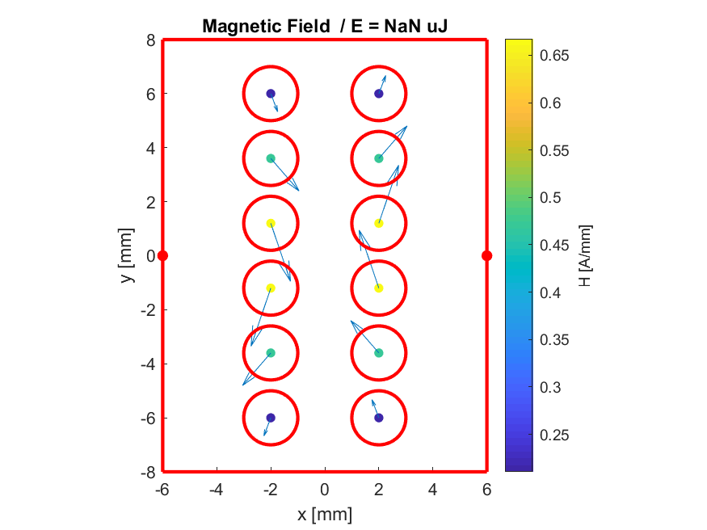
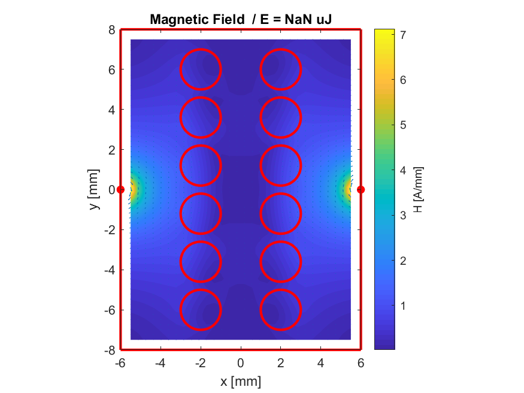
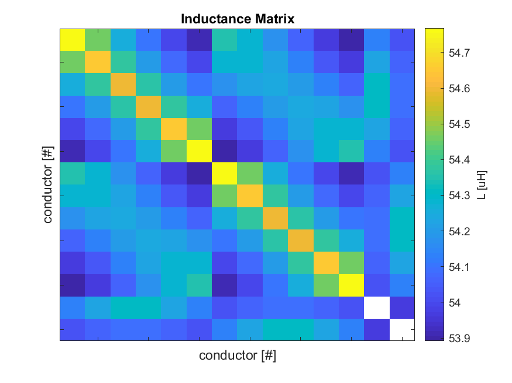
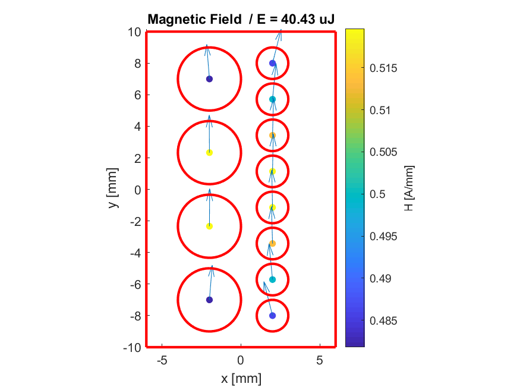
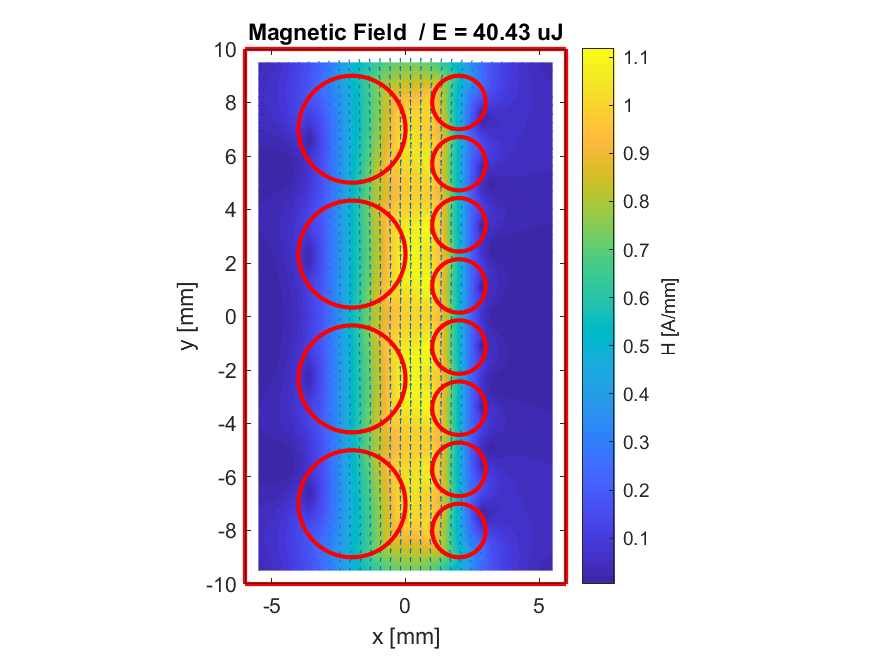
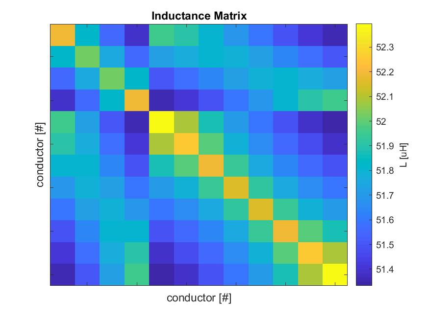
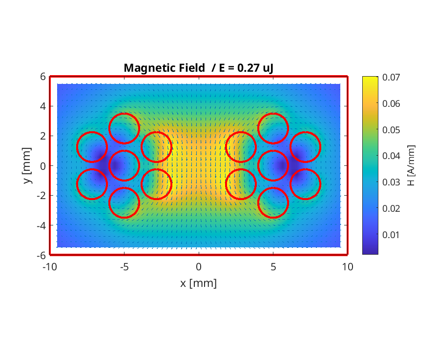
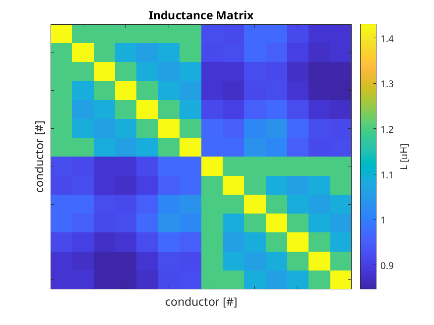
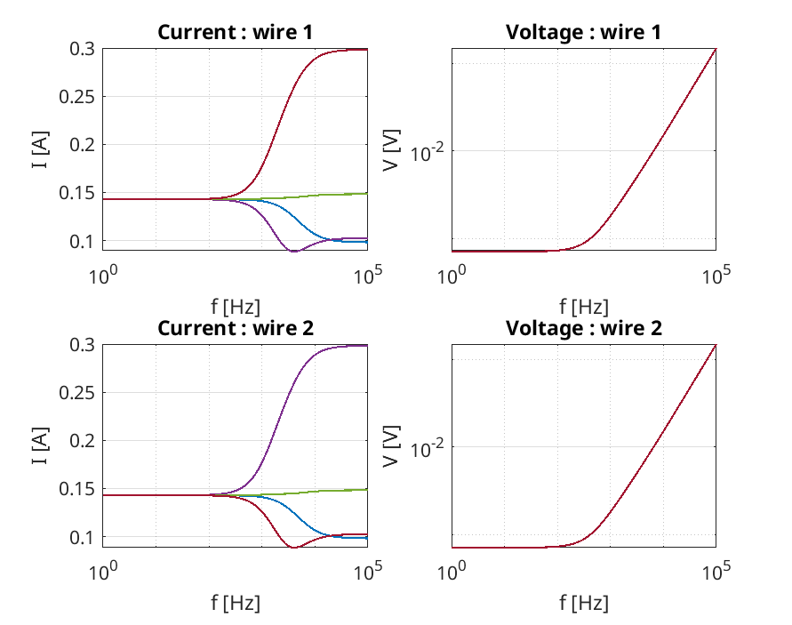

# Magnetic Mirroring Method with MATLAB

This **MATLAB** tool is a complete implementation of the **magnetic mirroring method** also known as **method of images**.
The complete implementation is **object oriented** and includes several **examples**.
The tool be used to compute the magnetic properties of different components, e.g., **inductors, transformers, and litz wires**.

The following properties can be computed:
* **Magnetic field pattern** (vector or norm)
* **Inductance matrix** between the conductors
* **Energy** for a given excitation
 
The following configurations can be computed:
* Conductors in free space (no magnetic boundary)
* Conductors surrounded by a single magnetic boundary
* Conductors surrounded by two parallel magnetic boundaries
* Conductors surrounded by a box of four magnetic boundaries

The following additional features and constraints exist:
* The magnetic boundary can feature finite permeability
* The conductors are accepted to be round with an uniform current density
* The conductors are accepted to be round with an uniform current density.
* The radius and the position of the different conductors is arbitrary
* Line conductors (without zero radius) are accepted
* No HF effects (skin or proximity) are considered (can be added in post-processing)

## Examples

The following examples are included:
* [test_inductor.m](test_inductor.m) - Simulation of an inductor with air gaps
* [test_transformer.m](test_transformer.m) - Simulation of a transformer
* [test_litz.m](test_litz.m) - Current sharing problem for untwisted litz wires

### Inductor Field

    
    
    

### Transformer Field

    
    
    

### Litz Wire Current Sharing

    
    
    

## Compatibility

The tool is tested with the following MATLAB setup:
* Tested with MATLAB R2018b or 2019a
* No toolboxes are required.
* Compatibility with GNU Octave not tested but probably easy to achieve.

## References

The following references explain the theory and applications of the mirroring method:
* Muehlethaler, J. / Modeling and Multi-Objective Optimization of Inductive Power Components / ETHZ / 2012
* Ferreira, J.A. / Electromagnetic Modelling of Power Electronic Converters /Kluwer Academics Publishers / 1989.
* Bossche, A. and Valchev, V. / Inductors and Transformers for Power Electronics / CRC Press / 2005.
* Binns, K.J. and Lawrenson, P. J. / Analysis and Computation of Electric and Magnetic Field Problems / Elsevier/ 1973

## Author

* **Thomas Guillod, ETH Zurich, Power Electronic Systems Laboratory** - [GitHub Profile](https://github.com/otvam)

## License

* This project is licensed under the **BSD License**, see [LICENSE.md](LICENSE.md).
* This project is copyrighted by: (c) 2019-2020, ETH Zurich, Power Electronic Systems Laboratory, T. Guillod.
